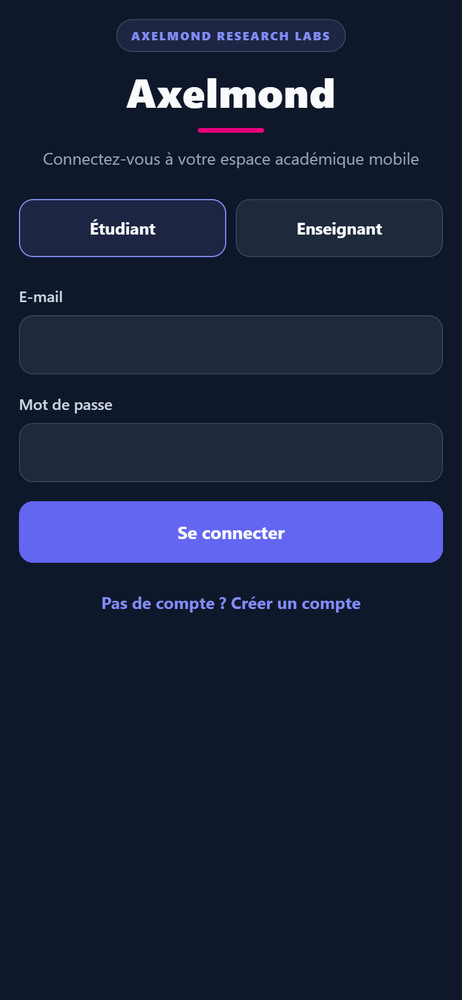
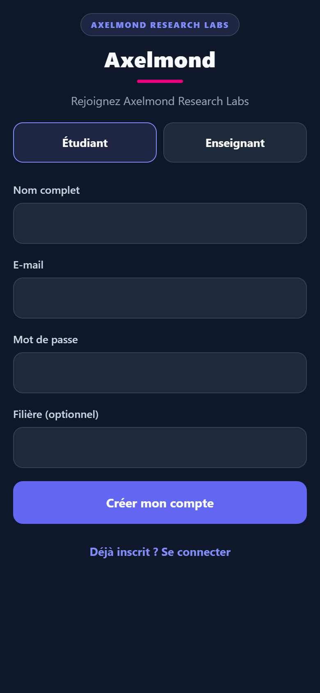
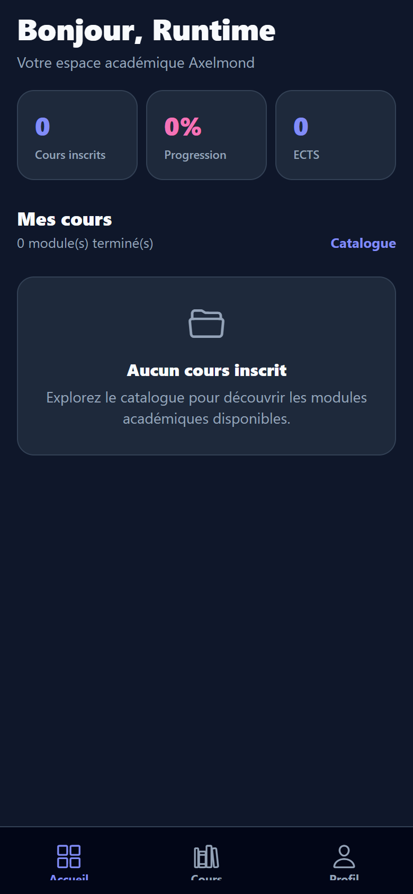
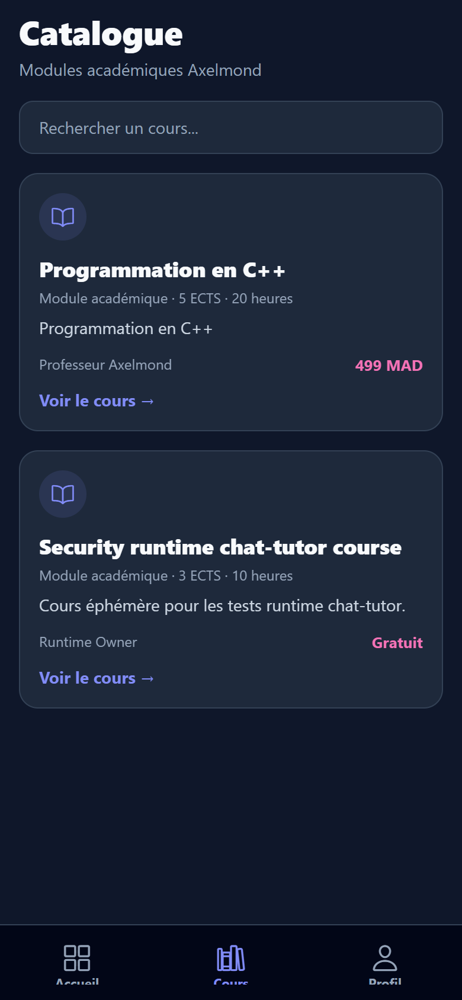
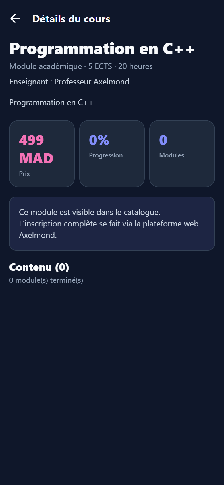
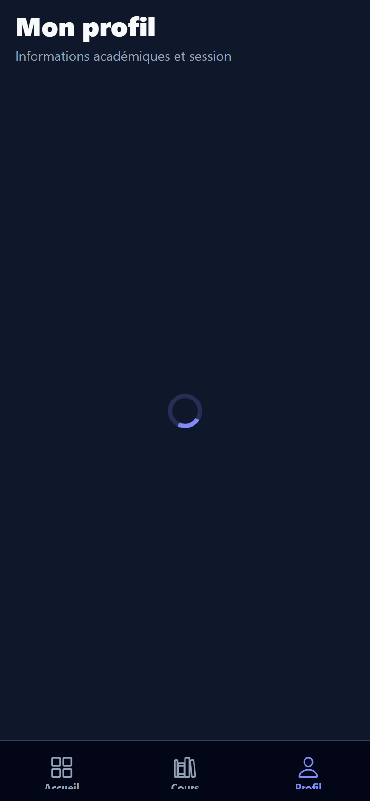
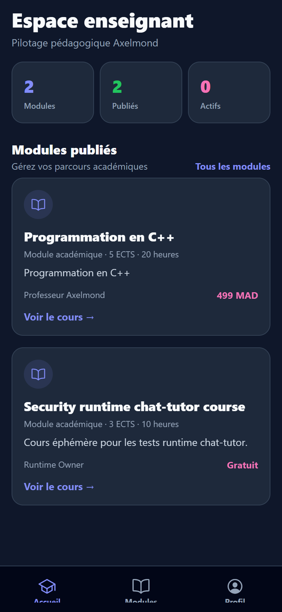
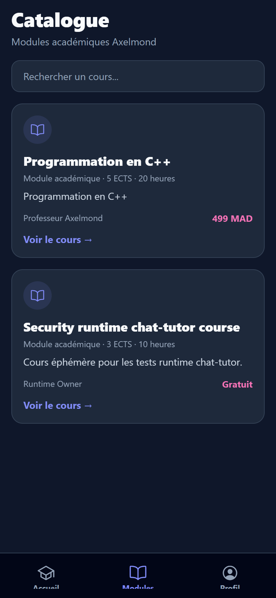
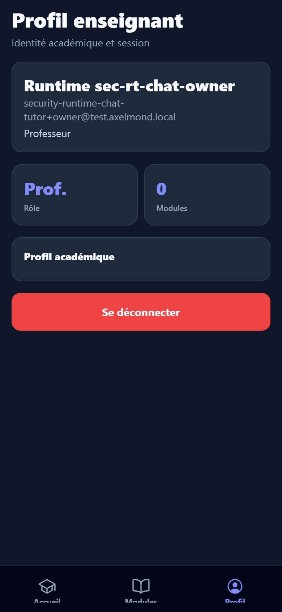

# Axelmond Mobile — Phase UI v1 Report (validation finale)

Date : 11 juin 2026  
Projet : `axelmond-mobile`  
Backend cible : `https://www.uroahumain.com/api`  
Stack : Expo 56 · React Native 0.85 · React Navigation 7

---

## Verdict validation finale

| Zone | Statut | Détail |
|------|--------|--------|
| API mobile (local, patch `bc1092b` + CORS preflight) | **OK** | 18/18 checks (`validate-final-v1.mjs`) |
| Flux UI étudiant + enseignant (Expo Web, API locale) | **OK** | Navigation, login, catalogue, détail, profils, logout |
| JWT persistance (SecureStore / localStorage web) | **OK** | Session restaurée après rechargement |
| Refresh token | **OK** | `POST /api/auth/refresh` validé (API) |
| Expo Go + comptes réels sur **production** | **BLOQUÉ** | Patch mobile non déployé sur `uroahumain.com` |
| Device physique Android/iPhone | **À confirmer par l'utilisateur** | Voir instructions Expo Go ci-dessous |

**Commit / push non effectués** : la validation Expo Go avec l’API production par défaut n’est pas encore possible tant que le patch backend mobile n’est pas déployé.

---

## Objectif Phase v1

Première application Android/iPhone **stable et navigable**, connectée au backend Axelmond, **sans PayPal, sans LiveKit, sans notifications push**.

---

## Architecture livrée

```
axelmond-mobile/
  App.tsx
  src/
    components/     BrandHeader, Button, Input, CourseCard, StatCard, SectionHeader, EmptyState, ScreenContainer
    hooks/          useAuth, useCourses, useTheme
    navigation/     RootNavigator, AuthNavigator, StudentNavigator, TeacherNavigator, tabBar
    screens/        8 écrans v1
    services/
      api/          client.ts, auth.api.ts, courses.api.ts, profile.api.ts, index.ts
      authStorage.ts
    theme/          darkTheme + lightTheme prêt
    types/
  scripts/          test-api.mjs, test-ui-flow.mjs, validate-final-v1.mjs, capture-v1-screenshots.mjs
  docs/screenshots/ captures validation
```

---

## Écrans implémentés

| # | Écran | Route / Tab | API utilisée |
|---|-------|-------------|--------------|
| 1 | **LoginScreen** | Auth stack | `POST /api/auth/login` |
| 2 | **RegisterScreen** | Auth stack | `POST /api/auth/register` |
| 3 | **StudentDashboardScreen** | Tab Accueil | `GET /api/courses` + user JWT |
| 4 | **CourseCatalogScreen** | Tab Cours / Modules | `GET /api/courses` |
| 5 | **CourseDetailsScreen** | Stack | `GET /api/courses/:id` |
| 6 | **StudentProfileScreen** | Tab Profil | `GET /api/mobile/student-profile` |
| 7 | **TeacherDashboardScreen** | Tab Accueil | `GET /api/courses` |
| 8 | **TeacherProfileScreen** | Tab Profil | `GET /api/me/profile` |

### Navigation

- **Non connecté** : Stack Auth (Login ↔ Register)
- **Étudiant** : Bottom Tabs (Accueil · Cours · Profil) + Stack (Détails cours)
- **Enseignant** : Bottom Tabs (Accueil · Modules · Profil) + Stack (Détails cours)

### Exclusions Phase v1

- LiveKit / classe live retirée de la navigation
- PayPal / paiement non intégré
- `LiveClassroomScreen` supprimé

---

## Authentification JWT

- Access token + refresh token + CSRF stockés dans **Expo SecureStore** (fallback `localStorage` sur Expo Web)
- Header automatique : `Authorization: Bearer <token>`
- Header client : `X-Axelmond-Client: mobile`
- Refresh automatique sur HTTP 401 via `POST /api/auth/refresh`
- Déconnexion : `POST /api/auth/logout` + purge du stockage

---

## Captures d'écran

Environnement de capture : **Expo Web** (`localhost:8081`) + **API locale** (`http://127.0.0.1:31999`) + comptes fixtures runtime.

### Authentification





### Étudiant (post-login)









### Enseignant (post-login)







---

## Tests exécutés (11 juin 2026)

```bash
# Backend local (port 31999, SECURITY_RUNTIME_TEST=1)
cd axelmond-mobile
npm run typecheck          # OK
npm run test:ui            # OK
node scripts/validate-final-v1.mjs http://127.0.0.1:31999   # 18/18 OK
node scripts/capture-v1-screenshots.mjs                     # 9 captures OK
npm start                   # Expo Metro sur :8081
```

### Validation API (18 checks)

- Health + `/api/mobile/routes`
- Login étudiant + enseignant (refreshToken JSON)
- `/api/auth/me`, catalogue, détail cours, profils
- Refresh token + session après refresh + logout

### Validation UI

- Pas d’écran blanc observé sur les flux capturés
- Pas d’erreur rouge Expo après correction CORS + authStorage web
- Navigation fluide (tabs + stack détail cours)
- Layout correct viewport mobile 390×844

### JWT persistance

- Rechargement Expo Web après login : retour direct sur dashboard étudiant avec token conservé

### Production (`https://www.uroahumain.com`)

- `GET /api/health` : OK
- `GET /api/mobile/routes` : renvoie du HTML SPA (patch non déployé)
- Login mobile production : pas de `refreshToken` JSON → l’app affiche « Réponse d'authentification incomplète pour mobile »

---

## Lancer sur téléphone (Expo Go)

### Option A — Production (après déploiement du patch mobile)

1. Déployer sur `uroahumain.com` le commit `bc1092b` + correctif CORS preflight (`server.ts`)
2. Retirer `.env.local` ou ne pas définir `EXPO_PUBLIC_API_BASE_URL`
3. `cd axelmond-mobile && npm start`
4. Scanner le QR avec Expo Go
5. Tester login étudiant / enseignant, navigation, fermeture/réouverture app

### Option B — Validation immédiate via réseau local

1. Démarrer le backend Unicode en local (port 31999)
2. Créer `.env.local` :

```env
EXPO_PUBLIC_API_BASE_URL=http://<IP_LAN_PC>:31999
```

3. `npm start` (ou `npx expo start --tunnel` si téléphone hors LAN)
4. Utiliser les fixtures runtime ou vos comptes locaux

---

## Correctifs appliqués pendant la validation

| Fichier | Correction |
|---------|------------|
| `src/services/authStorage.ts` | Fallback `localStorage` sur Expo Web (SecureStore indisponible) |
| `server.ts` | CORS preflight pour header `X-Axelmond-Client` (Expo Web) |
| `scripts/run-local-validation.mjs` | Seed fixtures + validation API orchestrés |
| `scripts/capture-v1-screenshots.mjs` | Captures automatisées post-login |

---

## Checklist Phase v1

- [x] Login / Register / Logout
- [x] JWT SecureStore + refresh (API validée)
- [x] Dashboard étudiant + enseignant
- [x] Catalogue + détail cours
- [x] Profils étudiant + enseignant
- [x] Bottom tabs étudiant + enseignant
- [x] API centralisée `services/api/`
- [x] UI Axelmond dark mode
- [x] Tests automatisés + captures post-login
- [x] Expo démarré (`npm start`)
- [ ] Expo Go sur device réel avec API **production** (attend déploiement backend)
- [ ] Commit `complete mobile UI v1` + push (après validation production ou confirmation device)

---

## Prochaines phases (hors v1 — ne pas démarrer avant validation device)

- Phase v2 : LiveKit natif (`@livekit/react-native` + dev build)
- Phase v3 : PayPal / in-app purchase
- Notifications push

---

## Action requise pour clôturer

1. **Déployer** le patch mobile backend en production
2. **Tester Expo Go** sur Android/iPhone avec comptes réels
3. Si OK : `git add . && git commit -m "complete mobile UI v1" && git push origin main`
