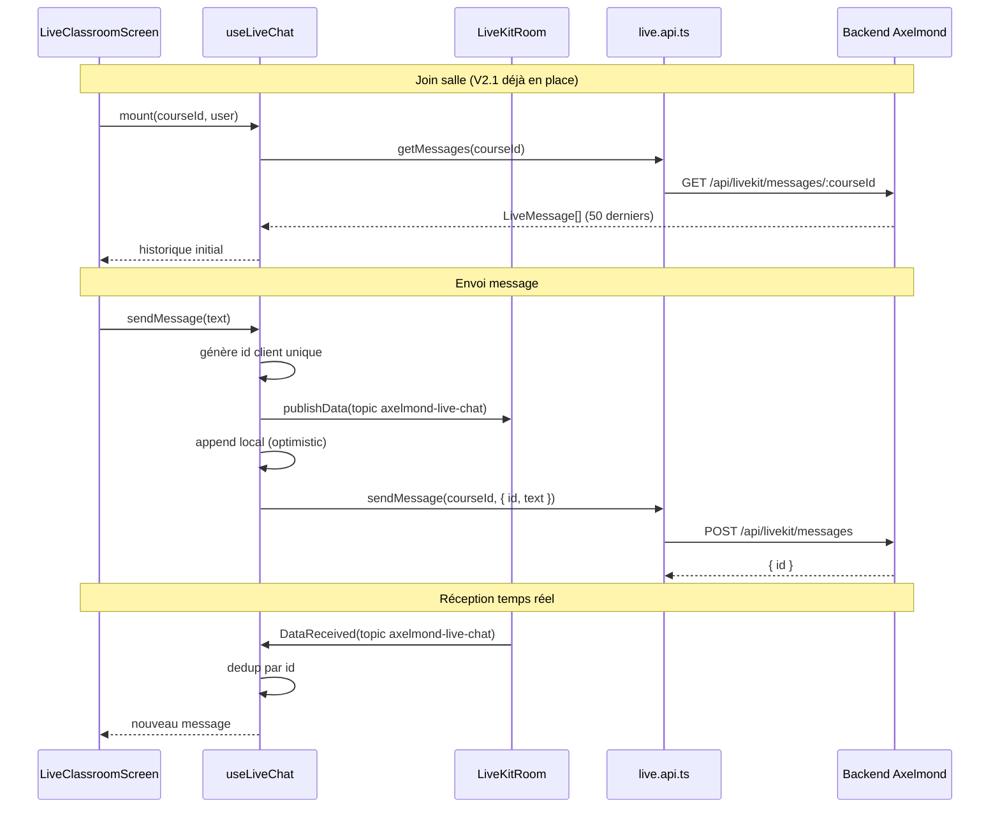

# Axelmond Mobile — Plan Phase V2.2 (Chat temps réel)

Date : 11 juin 2026  
Statut : **Planifié** — implémentation après validation device V2.1  
Prérequis : commit `add mobile livekit v2.1 classroom` (V2.1 A/V)

---

## Objectif V2.2

Ajouter le **chat temps réel** dans `LiveClassroomScreen`, avec parité fonctionnelle du web :
- Réception instantanée via LiveKit data channel
- Persistance serveur + historique au join
- UI simple (liste + champ d’envoi)
- Pas de réactions, main levée, modération (phases ultérieures)

---

## Architecture du chat temps réel



### Composants à créer (V2.2)

| Fichier | Rôle |
|---------|------|
| `src/hooks/useLiveChat.ts` | État messages, send/receive, dedup, chargement historique |
| `src/components/live/LiveChatPanel.tsx` | `FlatList` inversée + input + bouton envoyer |
| Extension `LiveClassroomScreen.tsx` | Panneau chat sous la zone vidéo (layout simple) |

### Intégration LiveKit (React Native)

Réutiliser le pattern web (`src/hooks/useLiveKitRoom.tsx`) adapté au SDK RN :

1. **Écoute** : `RoomEvent.DataReceived` ou hook `@livekit/react-native` équivalent (`useDataChannel` si disponible, sinon listener sur room via contexte `LiveKitRoom`).
2. **Publication** : `room.localParticipant.publishData(payload, { reliable: true, topic: "axelmond-live-chat" })`.
3. **Payload JSON** :

```json
{
  "id": "1739123456789-42",
  "sender": "Prénom Nom",
  "text": "Bonjour la classe",
  "time": "14:32"
}
```

4. **Topic** : `axelmond-live-chat` (identique web — ne pas modifier).

---

## Endpoints utilisés

| Méthode mobile | HTTP | Corps / params | Réponse |
|----------------|------|----------------|---------|
| `api.getMessages(courseId)` | `GET /api/livekit/messages/:courseId` | JWT Bearer | `LiveMessage[]` max 50, tri asc |
| `api.sendMessage(courseId, { id, text })` | `POST /api/livekit/messages` | `{ courseId, messageId, text }` | `{ id }` |

### Contrat `LiveMessage` (mobile)

```typescript
interface LiveMessage {
  id: string | number;
  sender: string;
  text: string;
  time: string;      // "HH:mm" locale fr-FR
  isMe: boolean;     // calculé serveur (userId === authUser.id)
}
```

### Règles backend (existantes, `server.ts`)

- **`assertLiveAccess`** : 403 si non inscrit / non autorisé
- **Historique** : `prisma.liveMessage.findMany` par `roomName`, `take: 50`
- **Persistance** : `upsert` sur `clientId` (= `messageId` mobile) — idempotent
- **Session** : `ensureLiveSession` crée/lie la session live au premier message

**Non utilisés en V2.2** : `logEvent`, `moderate`, `leaveAttendance` (V2.3+).

---

## Gestion historique messages

### Au join (avant / pendant connexion LiveKit)

1. Dès que `courseId` et JWT sont valides, appeler `api.getMessages(courseId)`.
2. Mapper chaque entrée en `LiveMessage` (déjà typé côté API).
3. Initialiser l’état chat avec cette liste (ordre chronologique asc).
4. Ne pas bloquer le join A/V si l’historique échoue — afficher warning discret + chat vide.

### Pendant la session

- Messages reçus via data channel **ajoutés** à la liste.
- Messages envoyés localement **ajoutés** immédiatement (optimistic UI).
- Limite mémoire UI : conserver les **50 derniers** messages en RAM (aligné backend).

### À la sortie

- Vider l’état chat (`clearMessages`) dans `leaveRoom` / unmount.
- Pas de cache persistant local en V2.2 (AsyncStorage prévu V2.3 si besoin offline).

---

## Stratégie anti-doublons

Le web append sans dedup explicite ; le mobile doit être plus strict (optimistic + echo data channel + persistance).

### Identifiant client

```typescript
const id = `${Date.now()}-${userId}`;
```

Aligné sur le web et le `clientId` Prisma.

### Règle d’insertion

```typescript
function appendMessage(prev: LiveMessage[], next: LiveMessage): LiveMessage[] {
  if (prev.some((m) => String(m.id) === String(next.id))) return prev;
  return [...prev.slice(-49), { ...next, isMe: next.isMe ?? isLocalSender(next) }];
}
```

### Cas couverts

| Cas | Comportement |
|-----|--------------|
| Envoi local + echo data channel | Même `id` → un seul message |
| Re-fetch historique après reconnect (V2.3) | `upsert` backend + dedup `id` |
| Message distant sans `id` | Fallback `${Date.now()}-${participantIdentity}` |
| POST `sendMessage` échoue après publishData OK | Message reste visible ; badge « non enregistré » optionnel V2.2.1 |

---

## Gestion offline / reconnexion

> **Hors scope implémentation V2.2** — documenté pour enchaîner proprement avec V2.3.

| Situation | Comportement V2.2 (MVP) | V2.3 (prévu) |
|-----------|-------------------------|--------------|
| Perte réseau en salle | Messages non envoyés : erreur toast, draft conservé | Queue outbound + retry |
| Reconnexion LiveKit | Chat vidé avec état room | Re-fetch `getMessages` + merge dedup |
| App background | Pas de sync chat | `AppState` → pause/resume listeners |
| Token JWT expiré | Erreur API via `getFreshAccessToken` | Identique V2.0 |
| Token LiveKit expiré (15 min) | Salle déconnectée, chat perdu | Refresh token + reload historique |

En V2.2 : désactiver l’input si `connectionState !== "connected"`.

---

## UI proposée (simple)

```
┌─────────────────────────────┐
│ Statut connexion            │
│ [Grille vidéo]              │
│ Participants (chips)        │
├─────────────────────────────┤
│ Chat (FlatList inverted)    │
│  Alice · 14:30              │
│  Bonjour                    │
│  Vous · 14:31               │
│  Question sur le module 2   │
├─────────────────────────────┤
│ [ input multiline ] [Envoyer]│
│ Mic · Cam · Quitter         │
└─────────────────────────────┘
```

- Pas de markdown, pièces jointes, mentions
- Scroll auto vers le bas à chaque nouveau message
- `keyboardAvoidingView` iOS / `android:windowSoftInputMode` déjà géré par Expo

---

## Tests prévus V2.2

| Type | Commande / scénario |
|------|---------------------|
| Statique | `npm run typecheck`, `test:ui`, `validate:v2-2` (script à créer) |
| API | `getMessages` + `sendMessage` via validate script |
| Device | 2 clients : envoi A → réception B < 2 s |
| Device | Re-open salle → historique 50 messages visible |
| Device | Dedup : un seul bubble par envoi local |
| Device | Offline input disabled quand déconnecté |

---

## Estimation détaillée

| Tâche | Détail | Durée |
|-------|--------|-------|
| **Hook `useLiveChat`** | Listeners data channel, state, send, dedup, load history | 1 j |
| **`LiveChatPanel` UI** | FlatList inversée, input, styles theme | 0.5 j |
| **Intégration écran** | Layout LiveClassroom + wiring user name | 0.5 j |
| **Script `validate-v2-2`** | Structure + smoke getMessages/sendMessage | 0.25 j |
| **Tests device** | 2 phones + historique + dedup | 1 j |
| **Doc + rapport V2.2** | `MOBILE-V2-2-REPORT.md` | 0.25 j |
| **Buffer bugs device** | Clavier, scroll, RN data channel edge cases | 0.5 j |
| **Total V2.2** | | **~3.5–4 j** |

### Jalons

| Jour | Livrable |
|------|----------|
| J1 | `useLiveChat` + historique au join |
| J2 | UI panel + envoi publishData + persist API |
| J3 | Dedup + tests automatisés + polish |
| J4 | Validation device 2 clients + rapport |

---

## Risques

| Risque | Mitigation |
|--------|------------|
| API `@livekit/react-native` data channel différente du web | POC listener dès J1 sur dev build |
| Clavier masque l’input chat | `KeyboardAvoidingView` + test iPhone |
| Doublons visibles | Dedup strict par `id` dès J1 |
| Historique vide si join avant premier message backend | Comportement normal ; documenter |

---

## Critères de done V2.2

- [ ] Historique chargé au join (`getMessages`)
- [ ] Envoi texte → visible local + autres participants < 2 s
- [ ] Persistance : après re-join, message toujours présent
- [ ] Pas de doublon sur envoi local
- [ ] Input désactivé si déconnecté
- [ ] Hors scope respecté (réactions, modération, attendance)
- [ ] Rapport `MOBILE-V2-2-REPORT.md` + validation device

---

## Prochaine étape

1. Compléter la **checklist device V2.1** (`docs/MOBILE-V2-1-DEVICE-CHECKLIST.md`)
2. Valider explicitement « V2.1 device OK »
3. Démarrer implémentation V2.2 selon ce plan
